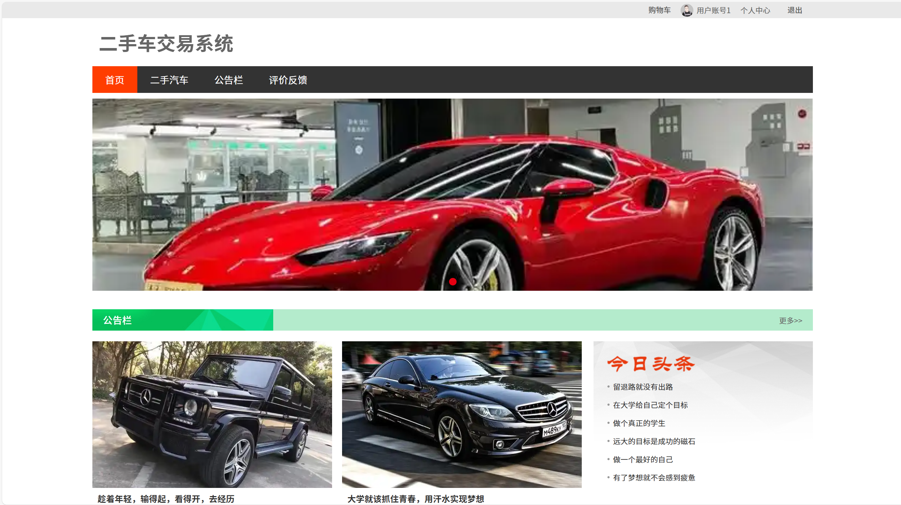

# springbootA403
springbootA403二手车交易系统+LW
 
## 查看主页获取源码

### 一、关键词

二手车交易系统，二手车买卖系统，二手汽车交易平台

 

### 二、作品包含

源码+数据库+设计文档万字+全套环境和工具资源+部署教程

 

### 三、项目技术

前端技术：Html、Css、Js、Vue2.0、Element-ui 
后端技术：Java、SpringBoot2.0、MyBatis

  

 

### 四、运行环境（以下版本亲测，其他版本未知，请自测）

开发工具：IDEA/eclipse  + VSCODE

数据库：MySQL5.7（最低要5.7版本）

数据库管理工具：Navicat10以上版本

环境配置软件： JDK1.8 + Maven3.6.3

前端Nodejs：14

浏览器：谷歌浏览器

 

### 五、项目介绍

项目编号：springbootA403

二手车交易系统相比于传统信息技术，时效性是它最大的特色，已经在电子娱乐、经济等中发挥着举足轻重的作用。更是短时间内迅速扩大了线上管理系统的规模。尽管事业单位已经有了很大程度的发展，但在二手交易管理领域上却少有建树。用户只能通过一些软件来查看二手汽车、公告栏、评价反馈等，这样的查询方式仍然是比较机械传统的，本系统通过对市面上常见的线上管理系统与现实生活中结合问题的讨论，从一个二手车交易系统角度进行需求分析，提供一些新的思路，并尝试做一些简单的实现。

 

### 六、运行截图

